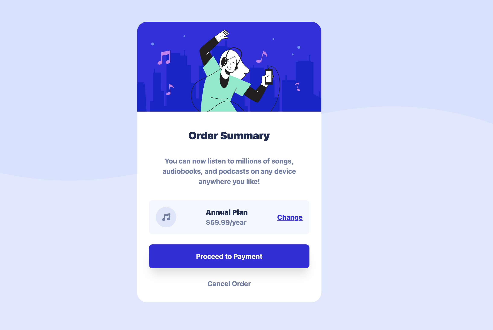

# Frontend Mentor - Order summary card solution

This is a solution to the [Order summary card challenge on Frontend Mentor](https://www.frontendmentor.io/challenges/order-summary-component-QlPmajDUj). Frontend Mentor challenges help you improve your coding skills by building realistic projects. 

## Table of contents

- [Overview](#overview)
  - [The challenge](#the-challenge)
  - [Screenshot](#screenshot)
  - [Links](#links)
- [My process](#my-process)
  - [Built with](#built-with)
  - [What I learned](#what-i-learned)
  - [Continued development](#continued-development)
  - [Useful resources](#useful-resources)
- [Author](#author)
- [Acknowledgments](#acknowledgments)

## Overview

### The challenge

Users should be able to:

- See hover states for interactive elements

### Screenshot

### Links

- Solution URL: [Add solution URL here](https://your-solution-url.com)
- Live Site URL: [Add live site URL here](https://your-live-site-url.com)

## My process

### Built with

- [Tailwindcss](https://tailwindcss.com)

### What I learned

While I already had some experience with Tailwindcss it was nice getting some more experience with it.

This was the first time I used an SVG as a background so it took a few tries to get that correct (and I also nearly forgot to implement it).

As a bit more abstract point I worked on actually finishing a project with this. Normally my projects quickly grow in scope, or I get bored of them and quit. With this one I wanted to focus on getting it done and submitted

### Continued development

After this I would like to practice writing just CSS without any frameworks to help. Using Tailwindcss was really nice, but I think if I keep focusing on that without fully understanding the basics of CSS I might run into problems down the line.

After that I would like to learn more about design itself. I hope to achieve some of this by making more projects, and learning from what others have designed. At some point I would like to be able to completely create my own designs and fully implement them.

## Author

- Github - [Frans-db](https://github.com/Frans-db)
- Frontend Mentor - [@Frans-db](https://www.frontendmentor.io/profile/Frans-db)
